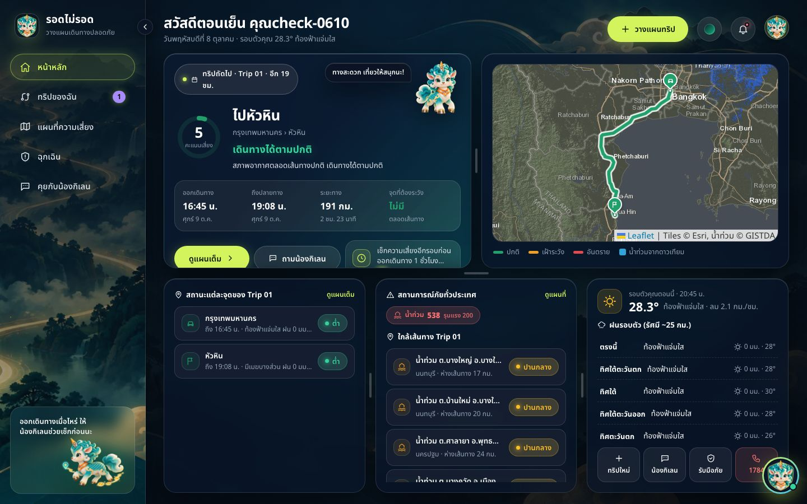
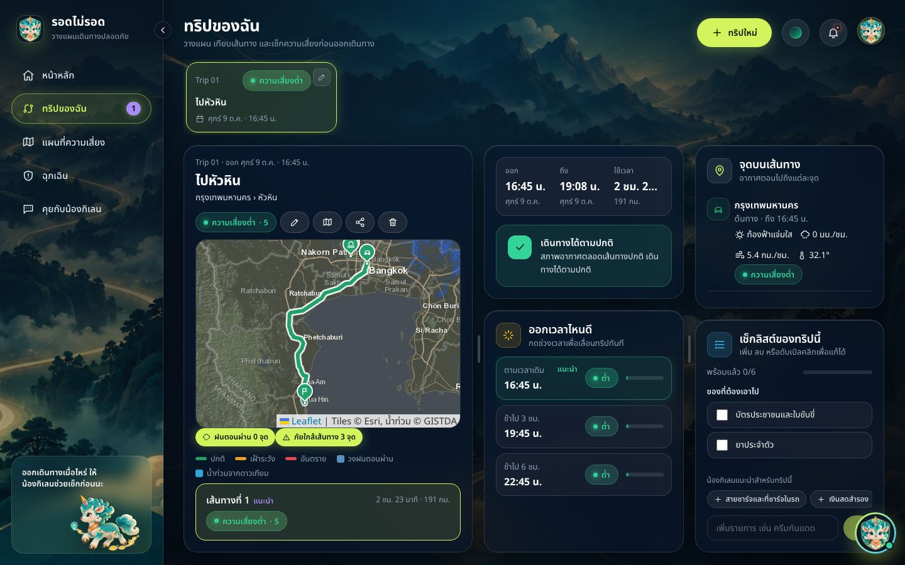
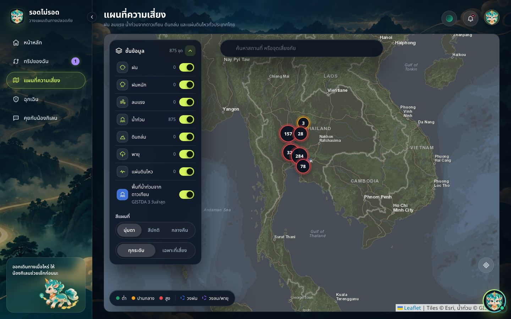
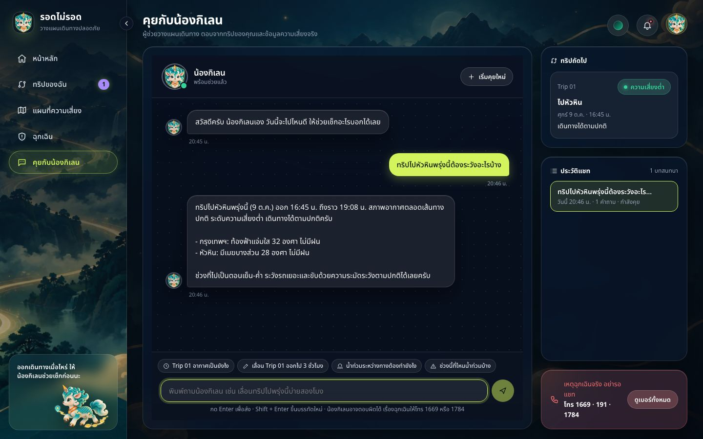
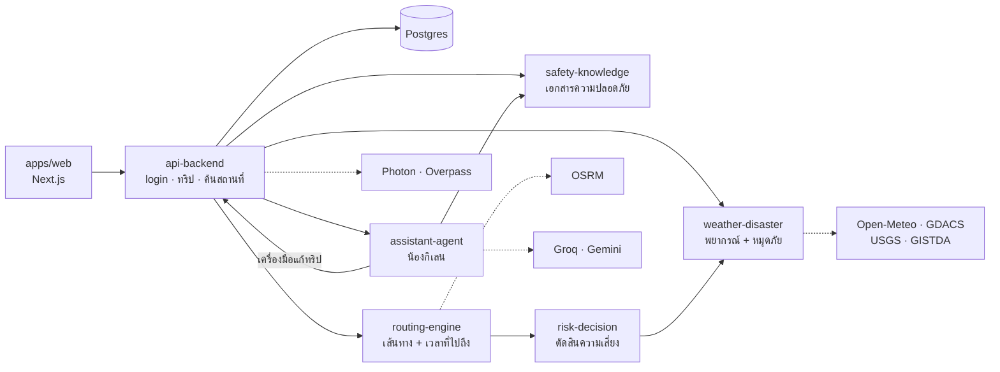

# LAB07 — Agentic AI System II: rod-mai-rod (team project)

English · [ภาษาไทย](README.th.md)

**Team repository: [pitchakorn-pkt/rod-mai-rod](https://github.com/pitchakorn-pkt/rod-mai-rod)** · live site: https://rod-mai-rod.tntproduction.tech

rod-mai-rod ("will I make it?") is a web app for planning safe road trips in Thailand,
built by a team of eight as the DL-07 *Agentic AI System II* assignment (AI smart travel
and emergency assistant). For each trip it checks the route, the weather forecast for the
hour the car reaches each point, flooding seen by satellite and nearby hazards, then
decides by rule whether to go, reroute, leave later or avoid the trip. An AI assistant,
"Nong Qilin", creates and edits trips through chat. It runs as a Next.js front end, six
Python services and PostgreSQL behind one `docker compose`.

**My part: module 5 — Routing Engine, and from 3 October the project itself.** For the
first two weeks I owned one service, `services/routing-engine/`. After every module had
reached `main` (#86), the repository was transferred to my account and I took over the
whole project: fixing what the team, the lecturer and the people trying the site found
after the first deploy, adding Google sign-in, releasing every change to `main`, and
rewriting the documentation. The team's own README, below the line, describes the system
and its measured results; this section describes what I did.

## What I did

### 1. Module 5 — the routing engine (24 September – 2 October)

Every trip plan starts here. The service asks OSRM for the routes, works out when the car
will reach each point, and hands those points to risk-decision.

| Pull request | |
|---|---|
| [#4](https://github.com/pitchakorn-pkt/rod-mai-rod/pull/4) | real routes from OSRM, with up to three alternatives |
| [#20](https://github.com/pitchakorn-pkt/rod-mai-rod/pull/20) | a sample point every 20 km along each route, plus every stop, each with its cumulative arrival time |
| [#23](https://github.com/pitchakorn-pkt/rod-mai-rod/pull/23) | demo mode that reads saved OSRM replies from `fixtures/` and makes no network calls |
| [#27](https://github.com/pitchakorn-pkt/rod-mai-rod/pull/27) | a detour built by the service itself when the only route is high risk |
| [#35](https://github.com/pitchakorn-pkt/rod-mai-rod/pull/35) | demo mode accepts a point tapped on the map within 15 km of a saved trip |
| [#79](https://github.com/pitchakorn-pkt/rod-mai-rod/pull/79) | the route geometry goes to risk-decision, so a flooded road counts only if the route really drives on it |

The parts that took real work:

- **Arrival time per point, not weather at planning time.** A long trip takes hours, so
  the service walks the full polyline with the haversine distance, drops a point every
  ~20 km, and splits each leg's duration in proportion to distance. Bangkok to Chiang Mai
  sends 72 points to risk-decision in one request, all routes together.
- **The public OSRM server is slow from Thailand.** Asking for `polyline` instead of
  GeoJSON cut one reply from 277 KB to 43 KB. A 47-second plan seen during integration
  came from the HTTP timeout counting each read separately, so the 12-second limit is now
  a real total, enforced with a thread pool. When it runs out the download continues in
  the background and fills the cache (keyed on coordinates rounded to 3 decimals) for the
  next request; HTTP 429 becomes a clear `RATE_LIMITED` error.
- **A detour when OSRM offers nothing else.** If the only route is HIGH risk, the service
  pushes a waypoint 50 km to either side of the risky point and keeps the fastest result
  that stays more than 20 km away from it and is at most 1.5 times slower, dropping
  waypoints outside Thailand. The whole request is held to a 42-second budget because
  api-backend waits 45, and a detour is only tried while enough of that budget is left.

The service has 55 pytest tests, all running on the saved fixtures.

### 2. Took over the project and fixed what came back from the first deploy (3–6 October)

After the first deploy, feedback came from three places: the team, the lecturer, and
people trying the site. I worked through it on one branch, one problem per commit (16
commits), and released it as [#89](https://github.com/pitchakorn-pkt/rod-mai-rod/pull/89)
→ `main` [#90](https://github.com/pitchakorn-pkt/rod-mai-rod/pull/90), then the chat
fixes and Google sign-in as [#91](https://github.com/pitchakorn-pkt/rod-mai-rod/pull/91)
and [#92](https://github.com/pitchakorn-pkt/rod-mai-rod/pull/92) →
[#93](https://github.com/pitchakorn-pkt/rod-mai-rod/pull/93).

- **The site froze with three users.** I measured layer by layer, as the lecturer asked —
  server, backend, database, AI — on the deploy image limited to 1 CPU and 2 GB. The
  database was not the problem; the CPU was full and api-backend used 82% of it. Two
  causes: every call to another service built a new HTTP client and reloaded the SSL
  certificates (~110 ms of CPU each, nine times per home page), and bcrypt at cost 12 took
  300 ms of CPU per login. One shared client per service and bcrypt cost 10 (old hashes
  are upgraded at the next login) brought **20 simultaneous users from 33.8 s to 3.9 s**
  per full round.
- **The whole system needs ~650 MB of RAM**, more than the 512 MB Render plan, so hosting
  moved to `docker compose` on a teammate's 2 GB server and I removed the Render setup.
- **The chat said things that were not true.** It answered "trip created" without
  creating one, moved a trip when asked "what if I moved it?", created the same trip twice,
  ended the return leg in Bangkok instead of where the trip started, and ignored GPS.
  Each is now enforced in code rather than left to the prompt: a trip is reported as
  created only after the tool really succeeded, what-if questions never edit, duplicates
  are blocked, the return leg is the outbound leg reversed exactly, and GPS is the start
  in both the form and the chat. Chat test sets: **30/32 → 32/32** and **33/34 → 34/34**.
- **Safety advice was wrong** — it told users to stay in the car as water rose — because
  the model answered from its own knowledge and the documents were too thin to retrieve.
  Safety answers now come from the documents only, the documents went from 7 to 10, and
  retrieval returns whole pieces of advice. Over 12 safety questions the share of expected
  points present in what was retrieved went from **38% to 80%**.
- **Sign in with Google** — the ID token is checked against Google's public keys, the
  audience must be our app and the e-mail verified; the same e-mail opens the existing
  account. Google requires `/privacy` and `/terms` before an app goes into production, so I
  wrote those too, along with display name and password change.
- **Highway closures from the Department of Highways** (HDMS), turned into hazard pins so
  risk-decision counts them only where the route passes. On 4 October it found 158
  incidents and turned a trip through Nakhon Sawan into "avoid". On the live server it
  found nothing: HDMS answers only Thai IP addresses and the server is abroad. I turned it
  off by default (#104) and made the chat mention closures only when there is real data.
- **The front end**: the real location instead of a silent Bangkok fallback, one-language
  map labels, university abbreviations in place search, light-theme contrast measured on
  every page, self-hosted Noto Sans Thai (the build used to break fetching it), and on
  phones a full-screen map, larger layer controls, menus that stay on screen and no
  pull-to-refresh (#104 → #105).

### 3. Releases, documentation and the presentation (4–8 October)

Every change went `dev` → `main` through a pull request with CI passing; a teammate runs
the server and deploys `main`. After each deploy I checked the live site end to end on
three screen sizes (166/166 checks on 6 October). I rewrote the team README so that it
matches the system as it is (#94–#103): the original team table kept as it was,
a maintenance note, the problems met during development with their causes, and the
current limits each with what it would take to lift them. After the presentation on
7 October I added screenshots of the live site, the architecture diagram, the reasons
behind the design and how each number was measured (#108 → #109). Outside the
repository I made the team's 20-slide presentation and a 39-slide technical deck, one
part per module, for answering the lecturer's questions.

## Timeline

| Date | |
|---|---|
| 24 Sep | module 5: OSRM routes (#4), 20 km sample points (#20), demo mode (#23), detour (#27), map-tap tolerance (#35) |
| 2 Oct | route geometry to risk-decision (#79) |
| 3 Oct | repository transferred to my account; added as code owner (#87, #88) |
| 4 Oct | post-deploy fixes, highway closures, safety answers (#89 → #90); chat fixes, GPS start, Google sign-in (#91, #92 → #93); README and docs (#94–#103) |
| 6 Oct | phones and DOH feed off by default (#104 → #105), README refresh (#106 → #107), live site checked |
| 7 Oct | presentation |
| 8 Oct | screenshots, diagram, design reasons, measurement details (#108 → #109) |

Of the 107 merged pull requests, 27 are mine — 6 for module 5 and 21 after I took over —
and I merged 23. On `main`, 46 of the 145 non-merge commits are mine; the merge commits
under the name `CHAMP` are also mine (my GitHub display name).

## What this does not establish

- The 33.8 s → 3.9 s load result was measured on my machine with the same image and the
  same CPU and memory limits, not on the live site, and plans and chat in that run were
  helped by the route cache.
- The 38% → 80% figure counts keywords of the expected points in the retrieved text; it
  measures coverage, not whether a final answer is correct.
- Chat results depend on the model and on the hazard data of the day; a rerun on another
  day may not match exactly.
- Highway closures are off on the live site, so the 158-incident result applies only to a
  server inside Thailand.

## What is in this folder

This folder is the whole team repository, not only my part. Module 5 is
[`services/routing-engine/`](services/routing-engine/). What I changed after taking over
is spread across `apps/web/`, `services/api-backend/`, `services/assistant-agent/`,
`services/safety-knowledge/`, `services/weather-disaster/` and the docs; the commit for
each problem is listed in the pull requests above. Every other folder belongs to the
member named in the team table below (section 7). How to run it is in section 4 below.

Pulled with `git subtree` from [pitchakorn-pkt/rod-mai-rod](https://github.com/pitchakorn-pkt/rod-mai-rod), branch `main`.

---

# รอดไม่รอด (rod-mai-rod)

เว็บวางแผนเดินทางในประเทศไทยให้ปลอดภัย เช็กเส้นทาง พยากรณ์อากาศ ณ เวลาที่รถไปถึงแต่ละจุด น้ำท่วมจากดาวเทียม และภัยพิบัติ ก่อนออกเดินทาง มีผู้ช่วย AI "น้องกิเลน" สร้างและแก้ทริปผ่านแชทได้

เว็บที่ใช้งานจริง: https://rod-mai-rod.tntproduction.tech

## สารบัญ

1. [ทำอะไรได้บ้าง](#1-ทำอะไรได้บ้าง)
2. [โครงสร้างระบบ](#2-โครงสร้างระบบ)
3. [แหล่งข้อมูลภายนอก](#3-แหล่งข้อมูลภายนอก)
4. [รันบนเครื่อง](#4-รันบนเครื่อง)
5. [ขึ้นเซิร์ฟเวอร์](#5-ขึ้นเซิร์ฟเวอร์)
6. [ทดสอบ](#6-ทดสอบ)
7. [ทีมและโมดูล](#7-ทีมและโมดูล)
8. [Git flow](#8-git-flow)
9. [ผลวัด](#9-ผลวัด)
10. [ปัญหาที่เจอและข้อจำกัด](#10-ปัญหาที่เจอและข้อจำกัด)
11. [เอกสารอื่น](#11-เอกสารอื่น)

---

## 1. ทำอะไรได้บ้าง

| หน้า | ทำอะไรได้ |
|---|---|
| เข้าสู่ระบบ | อีเมล + รหัสผ่าน หรือเข้าสู่ระบบด้วย Google |
| หน้าหลัก | ทริปถัดไปพร้อมคะแนนความเสี่ยงและคำแนะนำ · แผนที่เส้นทาง · สถานการณ์ภัยทั่วประเทศ · อากาศรอบตัว · ที่เที่ยวรอบตัว |
| ทริปของฉัน | สร้าง/แก้/ลบทริป (ต้นทางใช้ตำแหน่งปัจจุบันให้เอง, จุดแวะไม่เกิน 5) · หลายเส้นทางพร้อมเส้นที่แนะนำ · อากาศ ณ เวลาที่ไปถึงทุกจุด · "ออกเวลาไหนดี" เทียบออกช้า 3 / 6 ชม. · เช็กลิสต์ · แชร์ทริป |
| แผนที่ความเสี่ยง | หมุดฝน ลมแรง น้ำท่วม ดินถล่ม พายุ แผ่นดินไหว · ชั้นพื้นที่น้ำท่วมจากดาวเทียม GISTDA · เปิดปิดชั้นข้อมูลแต่ละชนิด · ค้นสถานที่หรือจุดภัย |
| ฉุกเฉิน | เบอร์ฉุกเฉิน · วิธีรับมือแต่ละภัยจากเอกสารหน่วยงาน · ส่งตำแหน่งและทริปให้ครอบครัว |
| คุยกับน้องกิเลน | ถามตอบเรื่องเดินทาง · สร้าง/เลื่อน/แก้ทริปด้วยข้อความ · ช่วงนี้ที่ไหนน้ำท่วม · วิธีรับมือภัย · แนะนำที่เที่ยว |

ใช้ได้ทั้งบนคอมพิวเตอร์และมือถือ

| หน้าหลัก | ทริปของฉัน |
|---|---|
|  |  |
| **แผนที่ความเสี่ยง** | **คุยกับน้องกิเลน** |
|  |  |

ภาพจากเว็บจริง 8 ต.ค. 2569 (ทริปกรุงเทพ > หัวหินของบัญชีทดสอบ)

ตัวอย่างคำสั่งแชท: "สร้างทริปไปหัวหินเสาร์นี้ 8 โมง กลับวันอาทิตย์" (ได้ทั้งขาไปและขากลับ) · "เลื่อน Trip 01 ไปวันถัดไป" · "ช่วงนี้ที่ไหนน้ำท่วมบ้าง" · "รถดับกลางน้ำต้องทำยังไง"

**คิดความเสี่ยงอย่างไร**: ใช้พยากรณ์ ณ เวลาที่รถไปถึงแต่ละจุดบนเส้นทาง (ไม่ใช่อากาศตอนกดวางแผน) รวมกับหมุดภัยใกล้เส้นทาง และถนนน้ำท่วมที่เส้นทางผ่านจริง แล้วตัดสินด้วยกฎว่า เดินทางได้ / เปลี่ยนเส้นทาง / เลื่อนเวลา / ควรเลี่ยง ระดับความเสี่ยงมาจากกฎเท่านั้น AI ไม่ได้ตัดสิน (เกณฑ์ละเอียดใน [`docs/CONTRACT.md`](docs/CONTRACT.md) หัวข้อ 4)

---

## 2. โครงสร้างระบบ

หน้าเว็บ Next.js + บริการ Python (FastAPI) 6 ตัว + Postgres หน้าเว็บคุยกับ api-backend ที่เดียว แล้ว api-backend ส่งต่อให้บริการอื่น



เส้นทึบ = บริการในระบบเรียกกัน · เส้นประ = เรียก API ภายนอก

**วางแผนทริป 1 ครั้งทำงานยังไง**

1. api-backend ส่งต้นทาง ปลายทาง จุดแวะ และเวลาออก ไปที่ routing-engine
2. routing-engine ขอเส้นทางจาก OSRM แล้ววางจุดตรวจทุก 20 กม. พร้อมเวลาที่รถจะไปถึงแต่ละจุด
3. risk-decision ขอพยากรณ์ ณ เวลาที่ไปถึงของทุกจุด และหมุดภัยใกล้เส้นทาง จาก weather-disaster แล้วตัดสินระดับด้วยกฎ
4. ถ้ามีจุดเสี่ยงสูง routing-engine ลองหาเส้นเลี่ยงที่ห่างจุดนั้นเกิน 20 กม. และช้ากว่าเส้นเดิมไม่เกิน 1.5 เท่า
5. api-backend บันทึกผลลงฐานข้อมูล หน้าเว็บแสดงคะแนน คำแนะนำ และอากาศรายจุด

| ส่วน | พอร์ต | หน้าที่ |
|---|---|---|
| `apps/web` | 3000 | หน้าเว็บทั้งหมด |
| `services/api-backend` | 8001 | login (อีเมล + Google), ทริปในฐานข้อมูล, ค้นสถานที่, ส่งต่องานไปบริการอื่น |
| `services/routing-engine` | 8002 | หาเส้นทาง (OSRM) และเวลาที่ไปถึงแต่ละจุด |
| `services/weather-disaster` | 8003 | พยากรณ์อากาศและหมุดภัยจากทุกแหล่ง |
| `services/risk-decision` | 8004 | ตัดสินระดับความเสี่ยงและคำแนะนำ |
| `services/assistant-agent` | 8005 | น้องกิเลน (LLM + เครื่องมือแก้ทริปจริง) |
| `services/safety-knowledge` | 8006 | เอกสารความปลอดภัย (RAG) และเบอร์ฉุกเฉิน |

รายละเอียดของแต่ละส่วนอยู่ใน README ของโฟลเดอร์นั้น · รูปแบบข้อมูลกลางและ endpoint ทุกเส้นอยู่ใน [`docs/CONTRACT.md`](docs/CONTRACT.md)

### เหตุผลที่ออกแบบแบบนี้

**ใช้พยากรณ์ ณ เวลาที่รถไปถึง ไม่ใช่อากาศตอนกดวางแผน**
ทริปไกลใช้เวลาหลายชั่วโมง ฝนที่ต้นทางตอนออกรถไม่ได้บอกว่าปลายทางตอนไปถึงจะเป็นยังไง จึงวางจุดตรวจทุก 20 กม. แล้วดึงพยากรณ์รายชั่วโมงของชั่วโมงที่รถไปถึงจุดนั้น

**ระดับความเสี่ยงตัดสินด้วยกฎ ไม่ให้ AI ตัดสิน**
ผลเหมือนเดิมทุกครั้งที่ข้อมูลเท่าเดิม อธิบายได้ว่าเสี่ยงเพราะจุดไหนเกินเกณฑ์อะไร และทดสอบได้ด้วย pytest · AI ใช้แค่อธิบายผลและรับคำสั่งในแชท

**หน้าเว็บคุยกับ api-backend ที่เดียว**
ตรวจ login และจำกัดจำนวนคำขอในจุดเดียว key ของ API ภายนอก (เช่น GISTDA) อยู่ฝั่งเซิร์ฟเวอร์ ไม่หลุดไปหน้าเว็บ

**แชทแก้ทริปผ่านเครื่องมือที่เรียก api-backend จริง และโค้ดตรวจผลก่อนตอบ**
โมเดลชอบตอบว่า "สร้างทริปแล้ว" ทั้งที่ไม่ได้สร้าง โค้ดจึงเช็กว่าเครื่องมือทำสำเร็จจริงก่อนยอมให้ตอบแบบนั้น และกันการสร้างทริปซ้ำในโค้ด ไม่ฝากไว้ที่คำสั่งให้โมเดล

**AI สำรองหลายชั้น**
Groq (Qwen) เป็นตัวหลัก ล่มหรือเต็มโควตาสลับ Gemini แล้ว Groq (gpt-oss) เอง ทุกตัวเรียกผ่านไลบรารี `openai` เปลี่ยนแค่ `base_url` ถ้าล่มหมด คำสั่งพื้นฐาน (เลื่อนทริป ถามอากาศของทริป) ยังทำงานด้วยกฎใน `rules.py`

**ค้นเอกสารความปลอดภัยด้วยการเทียบตัวอักษรทีละ 3 ตัว (trigram) ไม่ใช้ embedding**
ภาษาไทยไม่เว้นวรรคระหว่างคำ วิธีนี้ไม่ต้องตัดคำ ไม่ต้องโหลดโมเดลเข้าแรม และเอกสารมีแค่ 10 ไฟล์ · คำตอบเรื่องความปลอดภัยบังคับให้ตอบจากเอกสารเท่านั้น ไม่ให้โมเดลตอบจากความจำ

**มี `DEMO_MODE` อ่านข้อมูลที่บันทึกไว้แทนการเรียก API ภายนอก**
OSRM และพยากรณ์อากาศเป็นบริการสาธารณะที่ช้าหรือล่มได้ โหมดนี้ทำให้สาธิตเส้นทางตัวอย่างได้แม้เน็ตไม่ดี

---

## 3. แหล่งข้อมูลภายนอก

| แหล่ง | ใช้ทำอะไร | key |
|---|---|---|
| OSRM | เส้นทาง | ไม่ต้อง |
| Open-Meteo | พยากรณ์อากาศรายชั่วโมง | ไม่ต้อง |
| GDACS / USGS | ภัยพิบัติ / แผ่นดินไหว | ไม่ต้อง |
| GISTDA | น้ำท่วมจากดาวเทียม | `GISTDA_API_KEY` (สมัครฟรี) |
| HDMS กรมทางหลวง | ถนนปิด/น้ำท่วมบนทางหลวง · **ปิดอยู่** (เหตุผลในหัวข้อ 10.2) | ไม่ต้อง |
| Photon / Overpass | ค้นสถานที่ / ที่เที่ยวรอบตัว | ไม่ต้อง |
| Esri | แผนที่พื้นหลัง | ไม่ต้อง |
| Groq, Google Gemini | AI ของน้องกิเลน (Groq หลัก ล่มหรือเต็มโควตาสลับ Gemini เอง) | `GROQ_API_KEY`, `GROQ2_API_KEY`, `GEMINI_API_KEY` |
| Google | เข้าสู่ระบบด้วย Google | `GOOGLE_CLIENT_ID` |

---

## 4. รันบนเครื่อง

ต้องมี Docker Desktop และแรมว่างประมาณ 2 GB

```bash
cp .env.example .env   # แล้วใส่ key ตามตารางหัวข้อ 3
make up                # รันทั้งระบบ
make smoke             # ไล่เส้นหลัก login > สร้างทริป > วางแผน > แชท ต้องผ่านทุกข้อ
```

เปิด http://localhost:3000 บัญชีทดลอง `demo@example.com` / `demo1234`

ไม่มี `make` (Windows): ใช้ `docker compose up --build -d` แทน `make up` คำสั่งอื่นดูใน [`docs/RUNBOOK.md`](docs/RUNBOOK.md)
ไม่ใส่ key ก็รันได้ แต่แชทใช้ได้แค่คำสั่งพื้นฐาน และไม่มีชั้นน้ำท่วมจากดาวเทียม · ห้าม commit `.env`

---

## 5. ขึ้นเซิร์ฟเวอร์

ใช้ `docker compose` บนเซิร์ฟเวอร์ที่มีแรมอย่างน้อย 2 GB

```bash
git clone https://github.com/pitchakorn-pkt/rod-mai-rod.git && cd rod-mai-rod
# วาง .env ไว้ในโฟลเดอร์นี้
docker compose up -d --build
```

- อัปเดต: `git pull` แล้ว `docker compose up -d --build` (ข้อมูลในฐานข้อมูลยังอยู่)
- แก้ `.env` แล้ว: ใช้ `docker compose up -d --build --force-recreate` ให้ทุกบริการอ่านค่าใหม่
- หลังรีสตาร์ต รอราว 1 นาทีให้ข้อมูลน้ำท่วมจากดาวเทียมโหลดเสร็จ (log ของ weather-disaster ขึ้น `gistda flood: ... tambons`)
- ก่อนเปิดให้คนนอกใช้ เปลี่ยน `JWT_SECRET` และรหัส Postgres ใน `.env` จากค่าตัวอย่าง
- เปลี่ยนโดเมน ต้องเพิ่มโดเมนใหม่ใน Google Cloud (Authorized JavaScript origins) ไม่งั้นปุ่ม Google ใช้ไม่ได้

---

## 6. ทดสอบ

- เทสต์ของแต่ละบริการ: `cd services/<ชื่อ> && pip install -r requirements.txt pytest && pytest -q` (รวม 436 ข้อ ผ่านทั้งหมด)
- ทั้งระบบ: `make smoke`
- ทุก PR ต้องผ่าน CI บน GitHub (เทสต์ 6 บริการ + smoke) ก่อน merge

---

## 7. ทีมและโมดูล

### 7.1 สมาชิกและงานของแต่ละคน (แบ่งตั้งแต่เริ่มโปรเจกต์)

| # | โมดูล | โฟลเดอร์ | พอร์ตบนเครื่อง | ผู้รับผิดชอบ |
|---|---|---|---|---|
| 1 | Frontend: โครงเว็บ + Login + Overview | `apps/web/app/overview/` | 3000 | Patcharanat Budploy (@Patcharanat23) |
| 2 | Frontend: My Trip | `apps/web/app/my-trip/` | 3000 | Jirapa Gongmool (@jirapa-gm) |
| 3 | Frontend: Safety Map + หน้าแชท | `apps/web/app/safety-map/`, `apps/web/app/assistant/` | 3000 | Suphakorn Nonthong (@SoSick41) |
| 4 | API Gateway + Auth + ฐานข้อมูล | `services/api-backend/` | 8001 | Karmolputh Phatarathorn (@Chakamon02) |
| 5 | Routing Engine | `services/routing-engine/` | 8002 | Pitchakorn Phuadkhunthod (@pitchakorn-pkt) |
| 6 | Weather & Disaster | `services/weather-disaster/` | 8003 | Pathumporn Jorrapong (@pathumpornjorrapong-ops) |
| 7 | Risk & Decision | `services/risk-decision/` | 8004 | Jakkrich Sriraksa (@jakkrich0912-web) |
| 8 | Assistant Agent | `services/assistant-agent/` | 8005 | Patcharanat Budploy (@Patcharanat23) |
| 9 | Safety Knowledge (คำแนะนำความปลอดภัย + ฉุกเฉิน) | `services/safety-knowledge/` | 8006 | Phitphibul Phrompheak (@phitphibul67) |

โฟลเดอร์ในตารางเป็นตามแผนตอนแรก หลังเปลี่ยนดีไซน์ (PR #77, #82, #83, #84) หน้าเว็บย้ายไปอยู่ที่ `app/page.tsx` (หน้าหลัก), `app/trips/` (ทริปของฉัน), `app/map/` (แผนที่ความเสี่ยง), `app/assistant/` (แชท) และ `app/emergency/` (ฉุกเฉิน ของโมดูล 9) รายละเอียดว่าใครดูแลไฟล์ไหนอยู่ใน [`apps/web/README.md`](apps/web/README.md)

### 7.2 การดูแลโปรเจกต์ต่อ (ตั้งแต่ 3 ต.ค. 2569)

หลังรวมงานทุกโมดูลขึ้น `main` (PR #86) repo ย้ายจากบัญชีของ Patcharanat (@Patcharanat23) มาอยู่ที่ `pitchakorn-pkt/rod-mai-rod` และ **Pitchakorn (@pitchakorn-pkt) เจ้าของโมดูล 5 รับช่วงดูแลโปรเจกต์ต่อ** งานของแต่ละคนในตาราง 7.1 ยังเป็นของคนนั้นตามเดิม ส่วนที่ทำเพิ่มในช่วงนี้:

- แก้ปัญหาที่ทีม อาจารย์ และผู้ทดลองใช้เจอหลัง deploy รอบแรก (#89, #91)
- เพิ่มฐานความรู้ความปลอดภัย ปรับการตอบของแชท และเพิ่มข้อมูลถนนปิดจากกรมทางหลวง (#89) ซึ่งภายหลังปิดไว้ (หัวข้อ 10.2)
- เพิ่มการเข้าสู่ระบบด้วย Google และหน้า `/privacy` `/terms` (#92)
- ปรับหน้าเว็บบนมือถือ และปิดข้อมูลกรมทางหลวงเป็นค่าเริ่มต้น (#104, #105)
- ดูแลการ deploy และอัปเดตเอกสาร (#90, #93 ถึง #103)

ผลวัดอยู่ในหัวข้อ 9 · code owner ใน `.github/CODEOWNERS` คือ @Patcharanat23 และ @pitchakorn-pkt

---

## 8. Git flow

- ทำงานใน branch ของตัวเอง แตกจาก `dev` แล้วเปิด PR เข้า `dev` · รวมขึ้น `main` ด้วย PR จาก `dev` · `main` คือเวอร์ชันที่ขึ้นเว็บจริง
- ห้าม push ตรงเข้า `dev` / `main` · CI ต้องผ่านก่อน merge · merge แบบ merge commit เก็บ commit ของทุกคนไว้
- commit: `<type>(<module-slug>): <ทำอะไร>` เช่น `fix(assistant-agent): ...`

รายละเอียดใน [`docs/CONTRACT.md`](docs/CONTRACT.md) หัวข้อ 11

---

## 9. ผลวัด

ทุกตัวเลขมาจากการรันจริง วัดในเครื่องช่วง 4 ต.ค. 2569 ก่อนและหลังแก้ปัญหาในหัวข้อ 10.1

### 9.1 ก่อนและหลังแก้

| ตัวชี้วัด | ก่อน | หลัง | วัดอะไร |
|---|---|---|---|
| เวลาที่ 20 คนใช้พร้อมกันจนครบรอบ | 33.8 วินาที | **3.9 วินาที** | จำลองผู้ใช้ 20 คนพร้อมกัน แต่ละคน login > เปิดหน้าหลัก (ยิง API 12 เส้นพร้อมกัน) > วางแผนทริป > ถามแชท 1 ข้อความ บนเครื่องที่จำกัด CPU 1 core แรม 2 GB |
| ความครอบคลุมของเอกสารความปลอดภัยที่ค้นได้ | 38% | **80%** | 12 คำถาม (รถดับกลางน้ำ ดินถล่ม ฟ้าผ่า แผ่นดินไหว ฯลฯ) แต่ละข้อมีประเด็นที่คำตอบดีต้องมี 2-4 ประเด็น นับว่าข้อความที่ค้นได้มีคำสำคัญของประเด็นนั้นกี่ประเด็น |
| แชทผ่านเกณฑ์ ชุดแรก (16 คำถาม × 2 รอบ) | 30/32 | **32/32** | ถามตรงที่ assistant-agent (`/api/v1/chat`) ด้วยบัญชีทดลอง แล้วตรวจคำตอบด้วยเงื่อนไขของแต่ละข้อ เช่น สร้างทริปจริงไหม ตอบเบอร์ 1784 ไหม ไม่เขียนโค้ดเมื่อถูกขอ ถามอังกฤษตอบอังกฤษ |
| แชทผ่านเกณฑ์ ชุดที่สอง (17 คำถาม × 2 รอบ) | 33/34 | **34/34** | ชุดที่ใช้ตอนแก้แชทรอบสุดท้าย มีคำถาม "ตอนนี้ถนนไหนปิดบ้าง" ซึ่งวัดตอนยังเปิดข้อมูลกรมทางหลวงอยู่ (ตอนนี้ปิดแล้ว หัวข้อ 10.2) |

ข้อควรรู้: ผลคนใช้พร้อมกันวัดในเครื่อง ไม่ได้วัดบนเว็บจริง และการวางแผนกับแชทในรอบนั้นได้ประโยชน์จาก cache ของเส้นทาง · แชทขึ้นกับโมเดลและข้อมูลภัย ณ วันที่ถาม รันซ้ำวันอื่นอาจได้ไม่เท่ากัน

### 9.2 ชุดทดสอบอัตโนมัติ

| ชุด | ผล | รันซ้ำด้วย |
|---|---|---|
| pytest ทั้ง 6 บริการ | **436 ผ่าน** (api-backend 76 · routing-engine 55 · weather-disaster 109 · risk-decision 84 · assistant-agent 94 · safety-knowledge 18) | `cd services/<ชื่อ> && pytest -q` |
| smoke ทั้งระบบ (login > สร้างทริป > วางแผน > แชท ผ่าน :8001 และ :3000) | ผ่านทุกข้อ | `make smoke` |

---

## 10. ปัญหาที่เจอและข้อจำกัด

### 10.1 ปัญหาที่เจอระหว่างพัฒนาและวิธีแก้

| ปัญหา | ต้นเหตุ | แก้อย่างไร |
|---|---|---|
| คนใช้พร้อมกันไม่กี่คน ระบบช้าจน login ค้างและ timeout | CPU ของ api-backend ตัน: สร้างการเชื่อมต่อ HTTP ใหม่ทุกคำขอ และเข้ารหัสรหัสผ่านแบบ bcrypt 12 รอบ | ใช้การเชื่อมต่อร่วมกัน และ bcrypt 10 รอบ (รหัสเดิมแปลงให้ตอน login) 20 คนพร้อมกันจาก 33.8 เหลือ 3.9 วินาที |
| เว็บล่มเมื่อลดแพ็กเกจ Render | ทั้งระบบใช้แรมราว 650 MB เกินแพ็กเกจ 512 MB | ย้ายไปโฮสต์ด้วย docker compose บนเซิร์ฟเวอร์ที่มีแรม 2 GB |
| แชทบอกว่า "สร้างทริปแล้ว" แต่ไม่ได้สร้างจริง และพอถามซ้ำก็ตอบมั่ว | โมเดลตอบโดยไม่เรียกเครื่องมือ และในข้อความถัดไปแยกไม่ออกว่ารอบก่อนสร้างจริงไหม | โค้ดตรวจว่ามีการสร้างสำเร็จจริงก่อนยอมให้ตอบว่าสร้างแล้ว และแนบผลจริงไปในประวัติแชท |
| ถาม "ถ้าเลื่อนทริปไปบ่ายจะดีไหม" แล้วทริปถูกเลื่อนจริง | กฎคำสั่งตายตัวเห็นคำว่า "เลื่อน" ก็ทำเลย | แยกคำถามแบบสมมติออกจากคำสั่ง |
| พิมพ์ "สร้างเลย" ซ้ำแล้วได้ทริปซ้ำ / ขากลับจบที่กรุงเทพแทนจุดเริ่มต้น | โมเดลเรียกสร้างซ้ำ และพิมพ์ชื่อปลายทางขากลับเอง | กันทริปซ้ำในโค้ด และให้ระบบสร้างขากลับเองโดยสลับต้นทางกับปลายทางตรงตัว |
| อนุญาตตำแหน่งแล้วยังต้องกรอกต้นทางเอง บางครั้งใช้กรุงเทพแทนโดยไม่บอก | ขอตำแหน่งไม่ทันใน 3.5 วินาทีจึงใช้กรุงเทพแทนเงียบๆ และฟอร์มกับแชทไม่ได้ใช้ตำแหน่งเลย | รอได้นานขึ้น บอกผู้ใช้เมื่อใช้ตำแหน่งสำรอง และใช้ GPS เป็นต้นทางทั้งฟอร์มและแชท |
| แชทแนะนำความปลอดภัยผิด (เช่น ให้อยู่ในรถตอนน้ำขึ้น) | โมเดลตอบจากความรู้ตัวเอง และเอกสารมีน้อยจนค้นไม่เจอ | บังคับตอบจากเอกสารเท่านั้น เพิ่มเอกสารจาก 7 เป็น 10 ไฟล์ ค้นเจอคำตอบที่ถูกจาก 38% เป็น 80% |
| แชทสร้างทริปใหม่ไม่ได้ ถ้ามีทริปไปที่เดียวกันอยู่แล้ว | คำสั่งให้โมเดลจับคู่ "ทริปไปเชียงใหม่" กับทริปเดิม | กำหนดว่า "อยากไป X" คือทริปใหม่เสมอ |
| แผนที่มีชื่อภาษาไทย พม่า จีน เวียดนามปนกัน | แผนที่ OpenStreetMap ใช้ภาษาท้องถิ่นของแต่ละประเทศ | เปลี่ยนเป็นแผนที่ Esri ภาษาอังกฤษทั้งแผนที่ |
| ค้น "มทร" "ราชมงคลธัญบุรี" ไม่เจอ / ที่เที่ยวรอบตัวกองอยู่จุดเดียว | ระบบค้นไม่รู้จักคำย่อ และเลือกเฉพาะที่ใกล้ที่สุด | ขยายคำย่อก่อนค้น และเลือกที่เที่ยวกระจายจากใกล้ถึงไกล |
| ธีมขาวตัวหนังสือกลืนพื้น / เบอร์ฉุกเฉินแดงบนการ์ดแดง | ใส่สีตายตัวในบางจุด ไม่ได้เปลี่ยนตามธีม | ใช้สีตามธีม และวัดคอนทราสต์ทุกหน้าทั้ง 2 ธีม |
| build หน้าเว็บพังเป็นครั้งคราว / ตัวเลขดูไม่อยู่กลางกล่อง | โหลดฟอนต์จาก Google ตอน build และฟอนต์ส่วนอังกฤษสูงไม่เท่าส่วนไทย | เก็บไฟล์ฟอนต์ Noto Sans Thai ไว้ใน repo และปรับระยะของตัวอังกฤษ |
| หน้าแผนที่บนมือถือใช้ยาก: กรอบแผนที่เล็ก ปุ่มชั้นข้อมูลเล็กและโดนปุ่มแชทบัง · ลากจอลงแล้วหน้ารีเฟรช · เมนูแถบบนล้นจอ | หน้าแผนที่ออกแบบสำหรับจอคอม และเมนูกางจากขอบขวาของปุ่มเสมอ | บนจอเล็ก แผนที่เต็มจอ ชั้นข้อมูลเป็นปุ่มใหญ่ 2 คอลัมน์ ซ่อนปุ่มแชทตอนเปิดแผง กันการดึงรีเฟรช และให้เมนูกางเต็มความกว้าง |
| เว็บจริงไม่มีข้อมูลถนนปิดเลย แต่แชทตอบว่า "ทางหลวงที่ผ่านไม่ได้ 0 จุด" | HDMS ของกรมทางหลวงตอบเฉพาะ IP ในไทย เซิร์ฟเวอร์อยู่ต่างประเทศจึงดึงไม่ได้ | ปิดส่วนนี้เป็นค่าเริ่มต้น และให้แชทพูดถึงถนนปิดเฉพาะตอนมีข้อมูลจริง |
| ชั้นน้ำท่วมจากดาวเทียมบนแผนที่หายบนเว็บจริง ทั้งที่หมุดน้ำท่วมยังขึ้น | บริการที่ส่งภาพแผนที่ (api-backend) ไม่ได้อ่าน `GISTDA_API_KEY` จาก `.env` | สร้าง container ใหม่ด้วย `--force-recreate` (ใส่ไว้ในหัวข้อ 5 แล้ว) |

### 10.2 ข้อจำกัดตอนนี้

ทุกข้อรู้ตั้งแต่ตอนพัฒนา ยืนยันจากการวัดหรือการตรวจโค้ดแล้ว

| เรื่อง | สภาพตอนนี้ | ถ้าจะทำต่อ |
|---|---|---|
| ถนนปิดของกรมทางหลวง | HDMS ตอบเฉพาะ IP ในไทย แต่เซิร์ฟเวอร์อยู่ต่างประเทศ จึงปิดไว้ ถนนน้ำท่วมตอนนี้มาจากดาวเทียม GISTDA อย่างเดียว · โค้ดยังอยู่ครบ · HDMS เป็น API ภายในของเว็บ ไม่ใช่ open data ทางการ | ย้ายเซิร์ฟเวอร์มาอยู่ในไทยแล้วตั้ง `DOH_HDMS=true` |
| เส้นทาง (OSRM) | ใช้เซิร์ฟเวอร์สาธิตสาธารณะ ไม่รับประกัน ถ้าล่มจะวางแผนเส้นทางไม่ได้ชั่วคราว | รัน OSRM ของตัวเองด้วยแผนที่ประเทศไทย |
| ค้นสถานที่ (Photon) | ใช้ตัวสาธารณะ บางช่วงตอบช้าเกิน 5 วินาที ระบบขึ้นว่าค้นไม่ทัน ให้ลองใหม่หรือปักหมุดบนแผนที่แทน | ใช้บริการค้นสถานที่ที่มี key หรือรัน Photon เอง |
| น้ำท่วมจากดาวเทียม | ขึ้นกับรอบที่ดาวเทียมผ่านและเมฆ ข้อมูลอาจช้าหลายวัน และรวมเป็นรายตำบล ไม่ใช่ขอบเขตน้ำที่แม่นยำ · หลังรีสตาร์ตใช้เวลาโหลดราว 1 นาที ระหว่างนั้นยังไม่มีหมุดน้ำท่วม | เพิ่มแหล่งระดับน้ำจากสถานีวัด (Thaiwater ที่เตรียมชื่อตัวแปรไว้แล้ว) |
| พยากรณ์อากาศ | ดูล่วงหน้าได้ราว 7 วัน ทริปที่ไกลกว่านั้นประเมินอากาศไม่ได้จนใกล้วันเดินทาง | วางแผนใหม่อัตโนมัติเมื่อทริปเข้าช่วง 7 วัน |
| เกณฑ์ความเสี่ยง | เกณฑ์ฝน ลม ระยะจากจุดภัย เป็นค่าตั้งต้นที่ทีมกำหนด ยังไม่ได้ปรับจากข้อมูลอุบัติเหตุจริง · ดินถล่มเป็นค่าที่ระบบประเมินเองจากฝนสะสมในพื้นที่ภูเขา 15 จุด ไม่ใช่ประกาศทางการ | เทียบเกณฑ์กับสถิติอุบัติเหตุช่วงฝนตก แล้วปรับค่า |
| ความเสี่ยงหลังวางแผน | แจ้งเตือนอยู่ในเว็บเท่านั้น ไม่แจ้งเมื่อความเสี่ยงของทริปเปลี่ยนหลังวางแผนไปแล้ว | วางแผนใหม่อัตโนมัติวันละครั้ง แล้วแจ้งในเว็บหรือ LINE |
| โควตา AI | ใช้ AI แบบฟรี มีโควตาต่อนาที หลายคนแชทพร้อมกันจะสลับไปตัวสำรอง คำตอบอาจช้าลง | ใช้ key แบบเสียเงิน |
| ความแม่นของแชท | มีด่านกันความผิดพลาดในโค้ดแล้ว แต่โมเดลยังตีความผิดได้บ้าง เช่น ไม่อนุญาตตำแหน่งและไม่บอกต้นทาง อาจใช้กรุงเทพเป็นต้นทาง (คำตอบแสดงเส้นทางให้เห็น แก้ได้) · ลบทริปผ่านแชทไม่ได้ (ตั้งใจ) | เก็บบทสนทนาที่ผิดมาเพิ่มเป็นชุดทดสอบ |
| ประวัติแชท | เก็บในเบราว์เซอร์ ไม่ซิงก์ข้ามเครื่อง | เก็บลงฐานข้อมูลผูกกับบัญชี |
| เซิร์ฟเวอร์ | เครื่องเดียว ไม่มีเครื่องสำรอง ไม่มี backup ฐานข้อมูลอัตโนมัติ และไม่มีระบบเฝ้าดูว่าล่มไหม | backup รายวัน + ระบบแจ้งเตือนเมื่อ `/health` ไม่ตอบ |
| จำกัดจำนวนคำขอ | login 10 ครั้ง/นาทีต่อ IP (ทั้งห้องใช้ wifi เดียวกันจะนับรวม) และแชท 10 ข้อความ/นาทีต่อคน · นับในหน่วยความจำ รีสตาร์ตแล้วเริ่มนับใหม่ | นับต่อบัญชีแทน IP สำหรับ login |
| บัญชีผู้ใช้ | ยังไม่มีลืมรหัสผ่าน และปุ่มลบบัญชี (ขอลบผ่านอีเมลในหน้า `/privacy`) | เพิ่มลืมรหัสผ่านทางอีเมล และปุ่มลบบัญชี |
| หน้าจอ | จอ 1280×800 หน้าทริปที่มี 2 เส้นทางให้เลือก แผนที่ย่อจะเตี้ย | ปรับ layout หน้าทริปบนจอเตี้ย |
| โค้ด | บางส่วนซับซ้อน แก้ยาก: ฟังก์ชันตัดสินความเสี่ยง (`risk-decision` `evaluate`) และหน้าหลัก/หน้าทริปที่เป็น component ใหญ่ | แยกเป็นฟังก์ชันและ component เล็กลง |

ใช้ได้เฉพาะในประเทศไทย

### 10.3 ฟีเจอร์ที่อยากเพิ่ม

- ลิงก์แชร์ทริปให้ครอบครัวติดตามสถานะ และกด "ถึงแล้ว"
- ใช้แบบออฟไลน์ได้ (เบอร์ฉุกเฉิน วิธีรับมือ แผนทริปล่าสุด) ตอนสัญญาณหาย

---

## 11. เอกสารอื่น

| ไฟล์ | อ่านเมื่อ |
|---|---|
| [`docs/CONTRACT.md`](docs/CONTRACT.md) | กฎกลาง รูปแบบข้อมูล endpoint git flow |
| [`docs/RUNBOOK.md`](docs/RUNBOOK.md) | อะไรพัง ทำยังไง |
| [`docs/DEMO_SCRIPT.md`](docs/DEMO_SCRIPT.md) | สคริปต์สาธิต |
| [`docs/SPEC.md`](docs/SPEC.md), [`docs/MODULES.md`](docs/MODULES.md), [`docs/PLAN.md`](docs/PLAN.md) | สเปกและการแบ่งงานช่วงพัฒนา |
| `apps/web/README.md`, `services/*/README.md` | รายละเอียดและวิธีรันของแต่ละส่วน |
